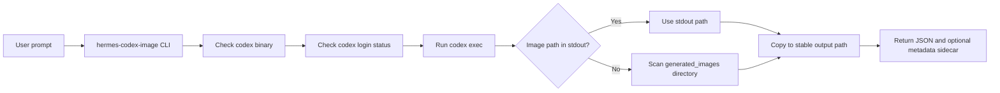

# Hermes Codex Image Skill

[](https://github.com/techkwon/hermes-codex-image-skill/actions/workflows/ci.yml)
[](https://www.python.org/downloads/)
[](LICENSE)

A polished, Python-first wrapper for **local Codex CLI image generation** that is designed for **Hermes/OpenClaw skills**, reproducible local automation, and honest public documentation.

> **What you get:** a small CLI + reusable skill script that checks local Codex login, runs `codex exec`, finds the generated image, copies it to a stable output path, and emits machine-readable JSON.

## Start here

### If you are a first-time human user
- Read: [docs/HERMES_AGENT_INSTALL.md](docs/HERMES_AGENT_INSTALL.md)
- Then run the exact install commands from that guide

### If you are handing this repo to Hermes/OpenClaw
- Read: [AGENTS.md](AGENTS.md)
- Then tell the agent to check Python, Codex install, Codex login, install the repo, and verify lint/tests/build

---

## Why this repository exists

Local Codex image generation is useful in practice, but the raw workflow is awkward for automation:

- output paths are buried in Codex stdout or under `~/.codex/generated_images/...`
- higher-level automations need structured JSON, not ad-hoc terminal scraping
- team workflows need explicit limitations and reproducible examples

This repository packages that path into something you can actually reuse.

---

## Showcase

### Example 1 — Research product hero generated through this wrapper


### Example 2 — Simple product asset generated through this wrapper


---

## Features

- **Codex preflight checks**
  - verifies `codex` exists in `PATH`
  - verifies local login state with `codex login status`
- **Stable image discovery**
  - extracts image paths directly from stdout when available
  - falls back to scanning `~/.codex/generated_images` or `$CODEX_HOME/generated_images`
- **Automation-friendly output**
  - returns structured JSON
  - optionally writes the same metadata to a sidecar JSON file
- **Hermes/OpenClaw ready**
  - includes a `skill/` folder with a reusable script entrypoint
- **Public-quality safety rails**
  - explicit limitation docs
  - tests for parsing, fallback discovery, preflight failures, and timeout handling

---

## What it is not

This repository is intentionally narrow.

It is **not**:
- a replacement for the OpenAI Images API
- proof of the exact backend image model identity used by Codex
- a full GUI or proxy service
- guaranteed to survive future Codex CLI behavior changes without maintenance

If you need a hosted API or direct model selection guarantees, use the official image API path instead.

---

## Positioning vs similar projects

We found related public work already exists.

- `Akuma-real/codex-canvas` — Textual/TUI workflow around Codex image generation
- `starhunt/duct-cli` — OpenAI-compatible adapter/proxy around Codex image generation
- `aymenbouferroum/gpt-imagen` — Claude Code plugin workflows for GPT Image-style generation/editing

### This repo's angle

This project focuses on:
- **Hermes/OpenClaw skill packaging**
- **Python implementation** that is easy to inspect and extend
- **local Codex login reuse** instead of API-only orchestration
- **clear public documentation of limits and assumptions**

More detail: [docs/COMPARISON.md](docs/COMPARISON.md)

---

## Installation

If you are completely new, start with [docs/HERMES_AGENT_INSTALL.md](docs/HERMES_AGENT_INSTALL.md).
That guide is written for both **human beginners** and **Hermes/OpenClaw agents**.

### Option A — local editable install

```bash
git clone https://github.com/techkwon/hermes-codex-image-skill.git
cd hermes-codex-image-skill
python3.11 -m venv .venv
source .venv/bin/activate
python -m pip install --upgrade pip setuptools wheel
pip install -e .[dev]
```

### Option B — make-based workflow

```bash
make PYTHON=python3.11 install
```

If your Python 3.11+ interpreter has a different name, point `PYTHON` at it explicitly.

---

## Prerequisites

- Python **3.11+**
- local `codex` CLI available in `PATH`
- successful local `codex login`

Quick health checks:

```bash
codex --version
codex login status
```

---

## Quick start

```bash
hermes-codex-image \
  "Generate a premium hero image for a research visualization product called Paper Banana. Add Korean headline text exactly as: 논문을 한눈에" \
  --output /tmp/paper-banana-hero.png \
  --metadata-json /tmp/paper-banana-hero.json
```

Example JSON:

```json
{
  "ok": true,
  "source_path": "/Users/name/.codex/generated_images/.../ig_xxx.png",
  "final_path": "/tmp/paper-banana-hero.png",
  "mode": "copied",
  "session_id": "019d...",
  "login_status": "Logged in using ChatGPT",
  "model_hint": "gpt-5.4",
  "started_at": "2026-04-23T14:18:05.846883+00:00",
  "finished_at": "2026-04-23T14:19:57.076225+00:00",
  "duration_seconds": 111.231,
  "error": null
}
```

---

## CLI reference

```bash
hermes-codex-image --help
```

### Main options

| Option | Description |
|---|---|
| `prompt` | Image prompt sent to `codex exec` |
| `-o, --output` | Output image path. If omitted, uses `./output/<image-name>` |
| `--metadata-json` | Optional sidecar JSON file with the same structured result |
| `--timeout` | Timeout in seconds for the Codex run |
| `--extra-arg` | Repeatable passthrough arg added before the prompt in `codex exec` |
| `--version` | Print CLI version |

---

## Hermes / OpenClaw usage

The repository includes a reusable skill entrypoint under `skill/`.

For an agent-friendly handoff, see:
- [AGENTS.md](AGENTS.md)
- [docs/HERMES_AGENT_INSTALL.md](docs/HERMES_AGENT_INSTALL.md)

> **Packaging note:** the installable Python package focuses on the CLI/runtime code. Repository resources such as `skill/`, `docs/`, and example assets are intended for GitHub/source-distribution use.

```bash
python3 skill/scripts/generate_with_codex.py \
  "Generate a soft pastel onboarding illustration for an AI research workspace" \
  --output /tmp/onboarding.png \
  --metadata-json /tmp/onboarding.json
```

The script bootstraps `src/` into `sys.path`, so it works from a fresh clone before packaging.

---

## How it works



---

## Example prompts

See [docs/EXAMPLES.md](docs/EXAMPLES.md) for more, including Korean examples.

### Product hero

```bash
hermes-codex-image \
  "Generate a premium hero image for a research visualization product called Paper Banana. Show a realistic peeled banana transforming into layered academic charts on a clean desk. Add Korean headline text exactly as: 논문을 한눈에" \
  --output /tmp/paper-banana-hero.png
```

### Simple product asset

```bash
hermes-codex-image \
  "Generate a premium flat illustration of a single yellow banana centered on a very light cream background card with soft shadow. Clean modern product-asset style. No text." \
  --output /tmp/banana-card.png
```

---

## Development

### Local quality gates

```bash
make lint
make test
make build
```

Equivalent manual commands:

```bash
source .venv/bin/activate
ruff check .
pytest
python -m build
```

### CI

GitHub Actions runs:
- Ruff
- pytest
- build verification
- Python 3.11 / 3.12 matrix

---

## Documentation

- [Comparison with similar projects](docs/COMPARISON.md)
- [Known limitations](docs/KNOWN_LIMITATIONS.md)
- [Example prompts](docs/EXAMPLES.md)
- [Architecture notes](docs/ARCHITECTURE.md)
- [Release checklist](docs/RELEASE_CHECKLIST.md)
- [Contributing guide](CONTRIBUTING.md)

---

## Public quality notes

Before sharing outputs produced by this tool:

1. visually inspect the generated image
2. keep prompts and outputs under version control when relevant
3. avoid claiming an exact backend image model unless verified separately
4. document that the workflow depends on local Codex behavior

---

## Roadmap

- richer error classification for more Codex failure modes
- stronger regression fixtures for stdout/output-directory variations
- optional prompt preset library for Korean and English workflows
- pipx-friendly distribution polish

---

## License

MIT
