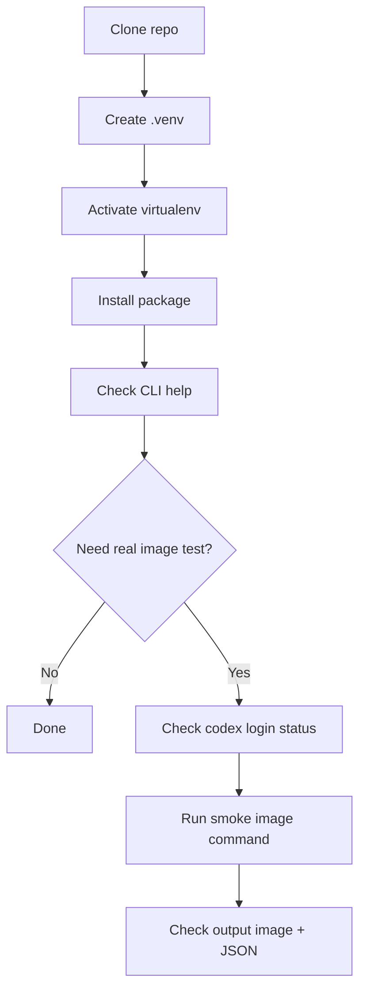

# Visual Quickstart

This page is for people who want the **shortest visual installation path**.

---

## One-screen summary



---

## Step 1 — Clone the repository

```bash
git clone https://github.com/techkwon/hermes-codex-image-skill.git
cd hermes-codex-image-skill
```

What this does:
- downloads the project
- moves you into the project folder

---

## Step 2 — Create a virtual environment

```bash
python3.11 -m venv .venv
```

What this does:
- creates an isolated Python environment just for this project

If `python3.11` does not exist, use another Python **3.11+** binary.

---

## Step 3 — Activate it

```bash
source .venv/bin/activate
```

What success looks like:
- your shell usually shows `(.venv)` at the beginning

---

## Step 4 — Install the package

```bash
python -m pip install --upgrade pip setuptools wheel
pip install -e .[dev]
```

What this does:
- upgrades basic packaging tools
- installs this project in editable mode
- installs dev tools like `ruff`, `pytest`, and `build`

---

## Step 5 — Verify the CLI exists

```bash
hermes-codex-image --help
```

If you see usage/help text, installation worked.

---

## Optional Step 6 — Verify Codex prerequisites

Only needed if you want a **real image generation test**.

```bash
codex --version
codex login status
```

You need both:
- Codex installed
- Codex logged in locally

---

## Optional Step 7 — Run a real smoke test

```bash
hermes-codex-image \
  "Generate a minimal banana icon on a light background" \
  --output /tmp/hermes-codex-image-smoke.png \
  --metadata-json /tmp/hermes-codex-image-smoke.json
```

Expected result:
- `/tmp/hermes-codex-image-smoke.png`
- `/tmp/hermes-codex-image-smoke.json`

---

## If you want Hermes Agent to do this for you

Give Hermes this prompt:

```text
Open this repository and install it for me like I am a first-time user. Check Python first, check whether Codex is installed and logged in, create the virtualenv, install the package, run lint/tests/build, and then summarize exactly what worked and what still needs my action.
```

---

## If you prefer text guides

- English: [HERMES_AGENT_INSTALL.md](HERMES_AGENT_INSTALL.md)
- Korean: [README.ko.md](README.ko.md)
- Agent handoff: [../AGENTS.md](../AGENTS.md)
